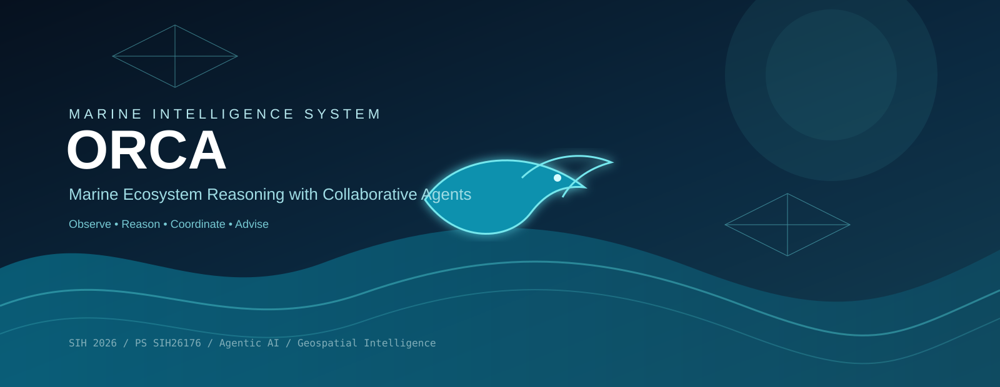
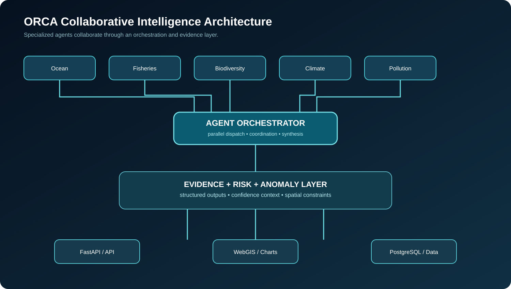
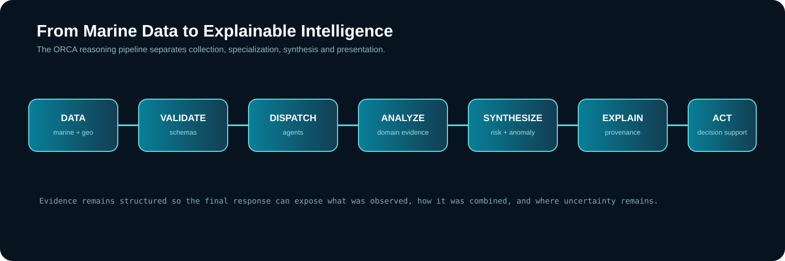
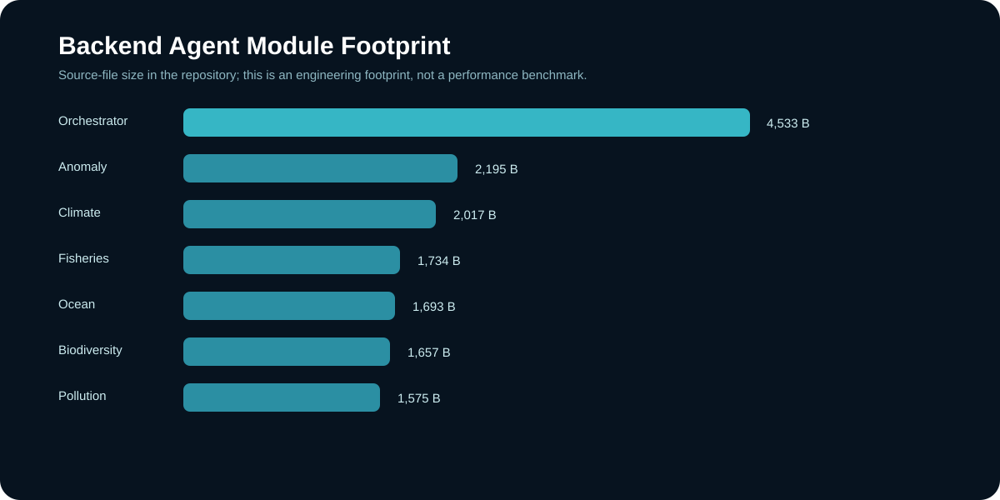

# ORCA

  

  <strong>Marine Ecosystem Reasoning with Collaborative Agents</strong> 
  A collaborative intelligence layer for marine, environmental and geospatial decision support.

  
  
  
  
  

---

## The one-line idea

**ORCA turns fragmented marine signals into structured, explainable intelligence by coordinating specialized domain agents through a central orchestration layer.**

Marine information is inherently heterogeneous: ocean conditions, fisheries, biodiversity, climate, pollution, geospatial boundaries and historical context do not naturally arrive as one coherent answer.

ORCA is designed to make them reason together.

## Why ORCA exists

A conventional information system answers:

> What does this dataset contain?

ORCA is designed around:

> What do all the relevant signals mean together?

That distinction drives the architecture.

~~~mermaid
flowchart LR
    A[Marine Signals] --> B[Specialized Agents]
    B --> C[Orchestrator]
    C --> D[Evidence + Risk Synthesis]
    D --> E[Explainable Intelligence]
    E --> F[API]
    F --> G[Map / Dashboard / Application]
~~~

---

# Architecture

  

~~~mermaid
flowchart TB
    USER[User / Application]

    subgraph PRESENTATION["Presentation"]
        WEB[React Interface]
        MAP[Leaflet / React-Leaflet]
        CHARTS[Recharts]
    end

    subgraph API["FastAPI Application"]
        ROUTES[API Routes]
        MODELS[Pydantic Models]
        SESSION[Session Services]
    end

    subgraph AGENTS["Collaborative Agent Layer"]
        ORCH[Orchestrator]
        OCEAN[Ocean]
        FISH[Fisheries]
        BIO[Biodiversity]
        CLIMATE[Climate]
        POLLUTION[Pollution]
    end

    subgraph INTELLIGENCE["Intelligence Layer"]
        AGG[Risk / Evidence Aggregation]
        ANOM[Anomaly Detection]
    end

    subgraph DATA["Data Layer"]
        DB[(PostgreSQL)]
        DEMO[Demo Scenarios]
        GEO[Geospatial Data]
    end

    USER --> WEB
    WEB --> ROUTES
    MAP --> ROUTES
    CHARTS --> ROUTES
    ROUTES --> MODELS
    ROUTES --> SESSION
    ROUTES --> ORCH
    ORCH --> OCEAN
    ORCH --> FISH
    ORCH --> BIO
    ORCH --> CLIMATE
    ORCH --> POLLUTION
    OCEAN --> AGG
    FISH --> AGG
    BIO --> AGG
    CLIMATE --> AGG
    POLLUTION --> AGG
    AGG --> ANOM
    AGG --> DB
    ANOM --> DB
    DEMO --> ORCH
    GEO --> MAP
    DB --> ROUTES
~~~

---

# The Agent Crew

ORCA separates marine intelligence into specialized components instead of asking one component to understand every domain.

| Component | Responsibility |
|---|---|
| Ocean Agent | Ocean-state and marine-condition reasoning |
| Fisheries Agent | Fisheries-related intelligence |
| Biodiversity Agent | Ecosystem and biodiversity reasoning |
| Climate Agent | Climate-related signals |
| Pollution Agent | Marine pollution analysis |
| Orchestrator | Dispatches and coordinates domain agents |
| Anomaly Detection | Flags unusual or inconsistent observations |
| Aggregation Layer | Combines evidence into structured outputs |

The agent modules live under the backend agent layer.

---

# Collaborative reasoning

~~~mermaid
sequenceDiagram
    participant U as User
    participant A as API
    participant O as Orchestrator
    participant OC as Ocean
    participant FI as Fisheries
    participant BI as Biodiversity
    participant CL as Climate
    participant PO as Pollution
    participant R as Aggregator

    U->>A: Submit query
    A->>O: Build execution context

    par Parallel domain analysis
        O->>OC: Analyze ocean signals
        O->>FI: Analyze fisheries signals
        O->>BI: Analyze biodiversity signals
        O->>CL: Analyze climate signals
        O->>PO: Analyze pollution signals
    end

    OC-->>R: Structured evidence
    FI-->>R: Structured evidence
    BI-->>R: Structured evidence
    CL-->>R: Structured evidence
    PO-->>R: Structured evidence

    R->>A: Unified result
    A->>U: Explainable response
~~~

The key design principle is **specialization followed by synthesis**.

---

# From data to decision

  

~~~text
OBSERVE
   |
   v
VALIDATE
   |
   v
DISPATCH
   |
   v
ANALYZE
   |
   v
SYNTHESIZE
   |
   v
CHECK
   |
   v
EXPLAIN
   |
   v
DECISION SUPPORT
~~~

---

# Evidence-first intelligence

The system is designed to distinguish between:

- observed data
- derived signals
- agent interpretations
- aggregated risk
- final explanation

~~~mermaid
flowchart LR
    RAW[Raw / Structured Data]
    DERIVED[Derived Features]
    AGENT[Agent Evidence]
    SYNTH[Cross-Agent Synthesis]
    RESULT[Explainable Result]

    RAW --> DERIVED
    DERIVED --> AGENT
    AGENT --> SYNTH
    SYNTH --> RESULT
~~~

The final response should be explainable in terms of the evidence that produced it.

---

# Geospatial intelligence

Marine intelligence is spatial by nature.

ORCA includes geospatial data and a frontend stack capable of rendering map-based context.

The spatial layer can support:

- coordinates
- ports
- maritime boundaries
- marine protected areas
- fishing-zone layers
- coastal hazard layers
- GeoJSON
- distance calculations
- geofencing logic

~~~text
                         NORTH
                           ^
                           |
             +-------------+-------------+
             |                           |
             |       MARINE REGION       |
             |                           |
             |            X USER         |
             |                           |
             |       [TARGET ZONE]       |
             |                           |
             +---------------------------+
                           |
                           v
                         SOUTH
~~~

The map is part of the reasoning interface, not merely a decorative visualization.

---

# Machine-learning layer

The repository contains an anomaly-detection module.

~~~mermaid
flowchart LR
    DATA[Observed Data] --> FEATURES[Feature Preparation]
    FEATURES --> MODEL[Anomaly Detection]
    MODEL --> DECISION{Anomalous?}
    DECISION -->|No| NORMAL[Normal Evidence]
    DECISION -->|Yes| FLAG[Flag for Review]
    NORMAL --> AGG[Reasoning Layer]
    FLAG --> AGG
~~~

Anomaly detection is treated as a signal for reasoning rather than an automatic replacement for domain validation.

---

# Engineering footprint

The following visual is a repository-code footprint, not a performance benchmark.

  

---

# Repository structure

~~~text
ORCA/
|
+-- backend/
|   +-- agents/
|   |   +-- biodiversity.py
|   |   +-- climate.py
|   |   +-- fisheries.py
|   |   +-- ocean.py
|   |   +-- orchestrator.py
|   |   +-- pollution.py
|   |
|   +-- database/
|   |   +-- schema.sql
|   |
|   +-- ml/
|   |   +-- anomaly.py
|   |
|   +-- models/
|   |   +-- ecosystem.py
|   |
|   +-- main.py
|
+-- data/
|   +-- demo/
|       +-- scenarios.json
|
+-- frontend/
|
+-- docs/
|   +-- visuals/
|
+-- docker-compose.yml
+-- package.json
+-- package-lock.json
+-- requirements.txt
+-- .env.example
+-- README.md
~~~

---

# Technology stack

## Backend

| Layer | Technology |
|---|---|
| API | FastAPI |
| ASGI server | Uvicorn |
| Validation | Pydantic |
| Numerical processing | NumPy |
| ML | scikit-learn |
| Database driver | psycopg2 |
| Database | PostgreSQL |

## Frontend

| Layer | Technology |
|---|---|
| UI | React ecosystem |
| Maps | Leaflet |
| React mapping | React-Leaflet |
| Charts | Recharts |
| Icons | Lucide React |
| Utility styling | Tailwind merge utilities |

---

# API architecture

~~~text
                         API
                          |
        +-----------------+-----------------+
        |                 |                 |
      QUERY             HEALTH           LAYERS
        |                 |                 |
        v                 v                 v
   ORCHESTRATOR      SYSTEM STATUS     GEOJSON DATA
        |
        v
   AGGREGATION
        |
        v
   UNIFIED RESULT
~~~

Core application capabilities include:

| Capability | Purpose |
|---|---|
| Query | Main conversational / reasoning workflow |
| Health | Service and agent health |
| History | Session context |
| Layers | Geospatial layers |
| Feedback | Ground-truth / user feedback |
| Mock Query | Frontend integration and demonstration |

---

# Demo data

The repository includes controlled scenarios under the demo data layer.

This enables reproducible development and demonstrations without pretending that simulated values are live operational observations.

~~~text
DEMO DATA
    |
    v
REPRODUCIBLE TESTING
    |
    v
AGENT INTEGRATION
    |
    v
LIVE DATA INTEGRATION
~~~

---

# Local development

## 1. Clone

~~~bash
git clone https://github.com/abidshareef/ORCA.git
cd ORCA
~~~

## 2. Create a virtual environment

### Windows

~~~powershell
python -m venv .venv
.venv\Scripts\activate
~~~

### Linux / macOS

~~~bash
python3 -m venv .venv
source .venv/bin/activate
~~~

## 3. Install backend dependencies

~~~bash
pip install -r requirements.txt
~~~

## 4. Configure environment

~~~bash
cp .env.example .env
~~~

On Windows PowerShell:

~~~powershell
Copy-Item .env.example .env
~~~

Populate required values before enabling services that depend on external credentials or databases.

## 5. Start the API

~~~bash
uvicorn backend.main:app --reload --port 8000
~~~

API:

~~~text
http://localhost:8000
~~~

OpenAPI documentation:

~~~text
http://localhost:8000/docs
~~~

---

# Docker

~~~bash
docker compose up --build
~~~

Stop the environment:

~~~bash
docker compose down
~~~

---

# Development principles

### 01 — Specialize

Keep domain logic inside the appropriate agent.

### 02 — Orchestrate explicitly

Agent collaboration should happen through clear interfaces.

### 03 — Separate evidence from explanation

A generated explanation should not become the source of truth.

### 04 — Preserve spatial context

Marine decisions without geography are incomplete.

### 05 — Measure before claiming

Accuracy, latency, reliability and safety metrics belong in the README only after reproducible measurement.

### 06 — Label simulated data

Demonstration data should never be presented as live environmental observations.

---

# Evaluation framework

~~~mermaid
flowchart TD
    E[ORCA Evaluation]
    E --> A[Agent Quality]
    E --> L[Latency]
    E --> R[Reliability]
    E --> X[Explainability]
    E --> G[Geospatial Accuracy]
    E --> U[User Task Completion]
~~~

Recommended measurements:

| Dimension | Example metric |
|---|---|
| Agent quality | Precision / Recall / F1 |
| Anomaly detection | Precision / Recall / F1 |
| API performance | p50 / p95 latency |
| Reliability | Failure rate |
| Geospatial processing | Spatial error |
| Evidence | Evidence coverage |
| UX | Task completion time |

No benchmark number is claimed here unless it comes from a reproducible experiment.

---

# Safety boundary

ORCA is a **decision-support research platform**.

It is not a replacement for official maritime, weather, fisheries, navigation, Coast Guard or emergency advisories.

Environmental conditions can change rapidly. Operational decisions should be verified against authoritative sources.

---

# Roadmap

~~~mermaid
timeline
    title ORCA Evolution

    Prototype : Multi-agent architecture
              : FastAPI backend
              : Geospatial layer
              : Demo scenarios

    Intelligence : Expanded marine datasets
                 : Better anomaly detection
                 : Evidence tracking
                 : Agent evaluation

    Integration : Real-time data providers
                : Richer WebGIS layers
                : Spatial-temporal analytics

    Deployment : Low-connectivity access
              : Voice interaction
              : Operational integrations
~~~

---

# The architectural thesis

~~~text
SPECIALIZED INTELLIGENCE
          +
CROSS-DOMAIN EVIDENCE
          +
EXPLICIT ORCHESTRATION
          +
SPATIOTEMPORAL REASONING
          +
ANOMALY SIGNALS
          +
EXPLAINABLE OUTPUT
~~~

The result is intended to behave more like a coordinated intelligence system than a single prompt-response model.

---

# Project identity

~~~text
ORCA

Observe
Reason
Coordinate
Advise
~~~

**The ocean is complex. The reasoning layer should not be.**

---

## Repository

https://github.com/abidshareef/ORCA

## License

See the repository license for the current licensing terms.
